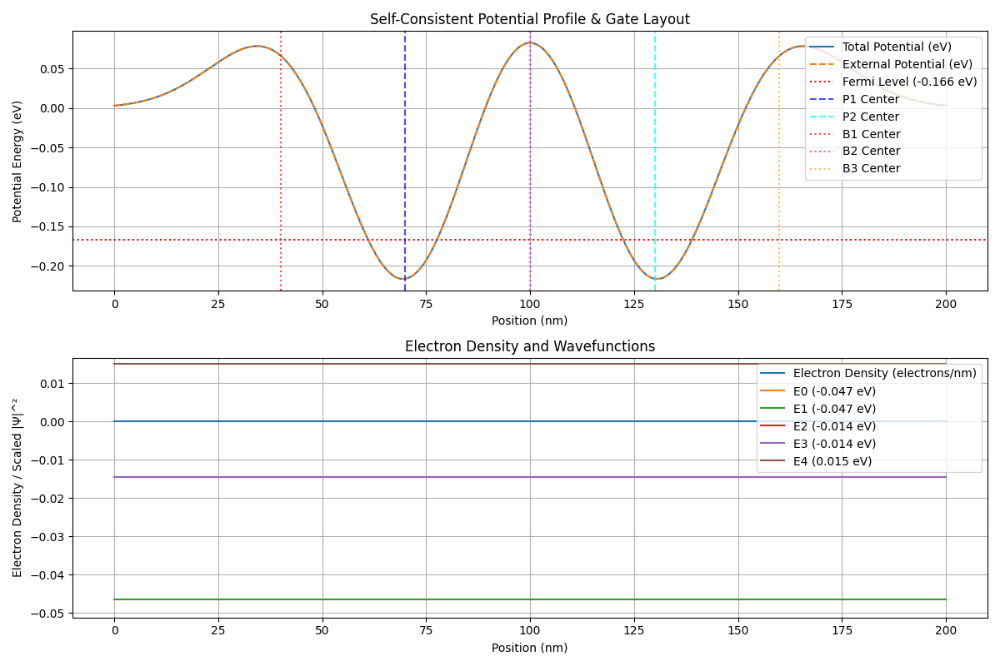

# Self-Consistent Schrödinger-Poisson Solver

This project implements a self-consistent Schrödinger-Poisson solver for simulating quantum transport in semiconductor devices. It includes both 1D and 2D simulations of quantum dots, and a charge stability simulation.

## Features

-   **Self-Consistent Iteration:** Iteratively solves the Schrödinger and Poisson equations until convergence is reached.
-   **1D and 2D Simulations:** Supports both one-dimensional and two-dimensional quantum dot simulations.
-   **Multiple Poisson Solvers:** Includes finite difference and spectral methods for solving the Poisson equation.
-   **Flexible Gate Potentials:** Allows for the definition of complex external potential profiles based on gate voltages.
-   **Charge Stability Diagrams:** Simulates charge stability diagrams for double quantum dots.

## Installation

1.  **Clone the repository:**

    ```bash
    git clone <repository_url>
    cd <repository_directory>
    ```

2.  **Install the dependencies:**

    ```bash
    pip install numpy scipy matplotlib hilbertcurve
    ```

    *   `numpy`: For numerical computations.
    *   `scipy`: For sparse matrix solvers and other scientific computations.
    *   `matplotlib`: For plotting and visualization.
    *   `hilbertcurve`: For generating Hilbert curves in charge stability simulations.

3.  **Install the spsim package:**

    ```bash
    pip install -e ./src
    ```

## Usage

### 1D Quantum Dot Simulation

The `scripts/simulate_1d_dot.py` script simulates a one-dimensional quantum dot.

```bash
python scripts/simulate_1d_dot.py
```

### 2D Quantum Dot Simulation

The `scripts/simulate_2d_dot.py` script simulates a two-dimensional quantum dot.

```bash
python scripts/simulate_2d_dot.py
```

### Charge Stability Simulation

The `scripts/simulate_charge_stability.py` script simulates the charge stability diagram of a double quantum dot.

```bash
python scripts/simulate_charge_stability.py
```

## Example Results

### 1D Simulation


*Replace this with the actual path to your 1D simulation image.*

### 2D Simulation


*Replace this with the actual path to your 2D simulation image.*

### Charge Stability Diagram


*Replace this with the actual path to your charge stability diagram image.*

## Project Structure

-   `scripts/`: Contains the main simulation scripts.
-   `src/spsim/`: Contains the source code for the solver.
    -   `constants.py`: Defines physical constants and material parameters.
    -   `device/`: Contains modules for defining the device geometry and potential.
    -   `solvers/`: Contains modules for solving the Schrödinger and Poisson equations.
    -   `simulation_runtime/`: Contains modules for running the self-consistent simulation.
    -   `measurement_helpers/`: Contains helper functions for performing sweeps and analysis.
-   `figures/`: Contains example results and plots.
-   `docs/`: Contains documentation (if any).

## Contributing

Contributions are welcome! Please feel free to submit pull requests or open issues.

## License

[Specify the license here, e.g., MIT License]
